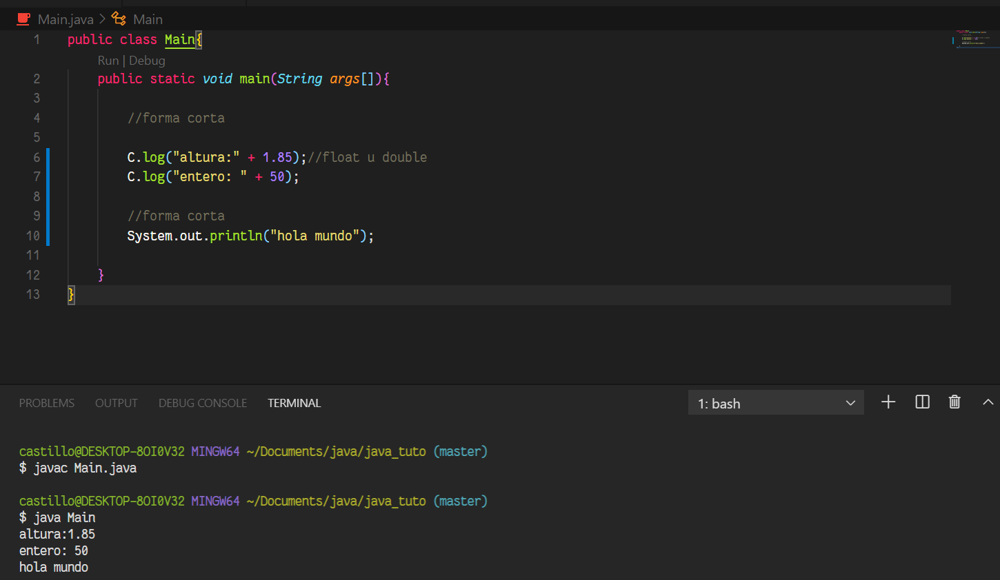
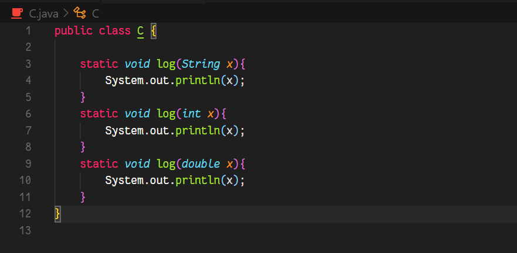

# COMO USAR CLASES PARA SIMPLIFICAR U ABSTRAER INTRUCCIONES LARGAS

## Clase principal



## Clase Secundaria



## Comandos para ejecutar el programa

```bash
$ javac Main.java
```
```bash
$ java Main
```
